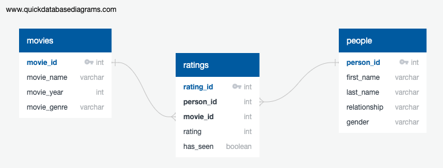

```{r setup, include=FALSE}
knitr::opts_chunk$set(echo = TRUE)
```

## Intro

I used PostgresSQL for this assignment. 

First I created a normalized database schema with tables for movies, ratings, and the people who were rating them. I chose to make the 'Rating' column null-able, in case someone hadn't seen a movie. I was worried that if I set the rating value to zero, it would be mistaken as a bad rating and/or it could mess up later attempts to get an accurate 'null value' count or percentage for the column. The ERD is below: 



I also created a Boolean column 'has_seen' specifically designed to track whether a person had seen that movie. I used that column in creating my csv so someone could see both the average rating and how many ratings that average was based off of. 

I created the schema using 'schema.sql' and inserted my data using 'data.sql'.

I exported my data from the 'query.sql' file using the GUI interface because I didn't want to grant blanket write permissions, and that is typically what I do at work as well given our remote servers.


```{r cars}
movie_averages <- read.csv('data/movie_averages.csv', header=TRUE)
head(movie_averages)
```
## Conclusion

There's not much data here, but based on what I've seen, I can note a few things. First, The Lego Movie was the only movie seen by all five reviewers. Second, Saw and Parasite were the worst and best rated movies respectively, but they were also the movies with the least number of reviews, and therefore I should be cautious with these numbers. 

If I had more data, I might look into trends based upon year of release, genre of the movie, or gender of my reviewers, all of which are available in my database. 
